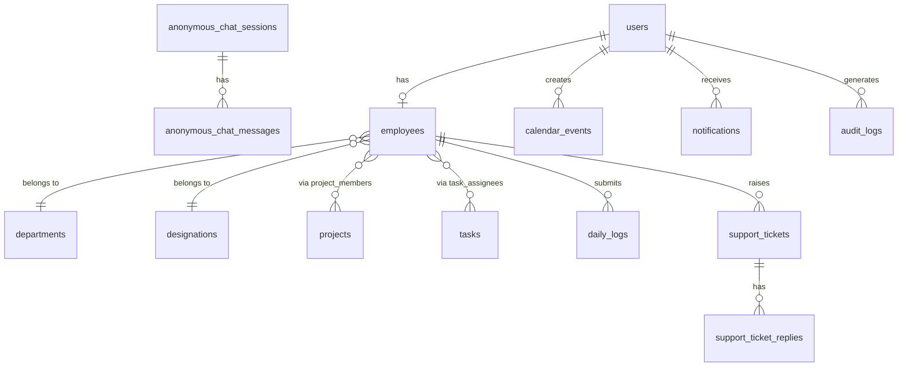

# Emperor-WorkSphere — SaaS Laravel Architecture Design

> **Project:** `Emperor-WorkSphere` | **Stack:** Laravel 12, PHP 8.2, MySQL, Blade  
> **Status:** UI shell only — no real backend logic exists yet  
> **Date:** 2026-02-25

---

## ⚠️ User Review Required

> [!IMPORTANT]
> No coding will begin until you review and approve this document. Every design decision below requires your explicit approval. After review, respond with any changes and I will update the plan accordingly.

> [!WARNING]
> The current codebase is **UI-only**. Every controller, every model (except `User`), every middleware, and every migration is an empty file or a static closure returning a view. The entire backend must be built from scratch.

---

---

# STEP 1 — FULL PROJECT ANALYSIS

## 1. Currently Implemented Features

| Feature | Status | Notes |
|---|---|---|
| Admin - Dashboard | ✅ UI Only | Static Blade view |
| Admin - Employees CRUD | ✅ UI Only | 4 views, no DB |
| Admin - Projects CRUD | ✅ UI Only | 4 views, no DB |
| Admin - Tasks CRUD | ✅ UI Only | 4 views, no DB |
| Admin - Daily Logs | ✅ UI Only | 2 views, no DB |
| Admin - Calendar | ✅ UI Only | Static view |
| Admin - Timeline | ✅ UI Only | Static view |
| Admin - Archived | ✅ UI Only | Static view |
| Admin - Profile | ✅ UI Only | Static view |
| Admin - Anonymous Chat | ✅ UI Only | Static Blade (8.8KB) |
| Admin - Support Tickets | ✅ UI Only | Static view |
| Admin - Login | ✅ UI Only | Form only, no auth |
| Employee - Dashboard | ✅ UI Only | Static Blade view |
| Employee - Projects | ✅ UI Only | 2 views |
| Employee - Tasks | ✅ UI Only | 2 views |
| Employee - Daily Logs | ✅ UI Only | 3 views |
| Employee - Calendar | ✅ UI Only | Static view |
| Employee - Team | ✅ UI Only | Directory view |
| Employee - Profile | ✅ UI Only | Static view |
| Employee - Support Tickets | ✅ UI Only | 2 views (list + create) |
| Employee - Anonymous Chat | ✅ UI Only | Static Blade (9.2KB) |
| Employee - Login | ✅ UI Only | Form only, no auth |

## 2. Missing Features (Backend — Everything)

- ❌ Authentication system (login/logout, sessions, guards)
- ❌ Role-based access control (Admin vs Employee)
- ❌ Route middleware protection
- ❌ Database migrations for all entities
- ❌ Eloquent Models with relationships
- ❌ Form Request validation
- ❌ Service layer & Repository pattern
- ❌ API Resources
- ❌ Employee creation and management logic
- ❌ Project assignment logic
- ❌ Task assignment and status tracking
- ❌ Daily log submission and review
- ❌ Calendar event creation (office on/off days)
- ❌ Anonymous chat backend (message storage, identity masking)
- ❌ Notification system
- ❌ Profile visibility (public/private) control
- ❌ File/avatar storage
- ❌ Support ticket backend
- ❌ Admin approval workflows
- ❌ Activity/audit logging
- ❌ Password reset flow

## 3. Required Entities

`User, Employee, Department, Designation, Project, ProjectMember, Task, TaskAssignee, DailyLog, CalendarEvent, AnonymousChat, AnonymousChatMessage, SupportTicket, SupportTicketReply, Notification, ProfileVisibilitySetting, AuditLog`

## 4. Required Relationships

```
User 1—1 Employee
Employee *—1 Department
Employee *—1 Designation
Employee *—* Project (via ProjectMember pivot)
Employee *—* Task (via TaskAssignee pivot)
Employee 1—* DailyLog
Employee 1—* SupportTicket
SupportTicket 1—* SupportTicketReply
Employee 1—* AnonymousChatMessage (masked identity)
CalendarEvent *—1 User (created_by)
Notification *—1 User (notifiable)
```

## 5. Data Flow Overview (Current vs Target)

**Current:** `Request → Route Closure → Blade View` (no backend)

**Target:** `Request → Middleware → Controller → FormRequest → Service → Repository → Model → DB → Resource → Response`

## 6. Security Concerns

- ❌ No authentication at all — all routes are publicly accessible
- ❌ No CSRF protection on forms (closures, no middleware)
- ❌ No role guards — any user could access admin routes
- ❌ No input validation anywhere
- ❌ Anonymous chat has no message content sanitization
- ❌ No rate limiting on login routes
- ❌ `.env` has empty DB_PASSWORD and `APP_DEBUG=true` in what could become prod

## 7. Scalability Concerns

- Static views won't scale to real data
- No pagination implemented
- No caching layer
- No queue system (configured in .env but unused)
- Database uses SQLite file in dev but MySQL in .env — inconsistency

## 8. Performance Concerns

- No eager loading strategies defined
- No database indexes planned
- No CDN / asset optimization strategy

## 9. Suggested Improvements

- Use **Laravel Sanctum** for SPA/token auth (simpler than JWT for this use case)
- Implement **Spatie Laravel Permission** for role/permission management
- Use **Service + Repository** architecture in all controllers
- Use **Laravel Events + Listeners** for notifications and audit logs
- Use **Laravel Queues** for email/notification dispatch
- Use **Laravel Storage** with public disk for profile photos
- Use **Database seeder** for admin seed on fresh install

---

---

# STEP 2 — SYSTEM WORKING DESIGN

## 2.1 End-to-End System Flow

### User Registration & Login Flow
```
Admin manually creates Employee record (no self-registration)
  → Sets email + temp password
  → Employee receives email with credentials (queue)
  → Employee goes to /employee/login
  → Credentials validated → Session created with 'employee' guard
  → Redirected to /employee/dashboard

Admin goes to /admin/login
  → Credentials validated → Session created with 'admin' guard
  → Redirected to /admin/dashboard
```

### Role Assignment Flow
```
Admin creates User → assigns role via Spatie Permission
  OR
Admin creates Employee record → employee guard auto-applies 'employee' role
Admin account has 'admin' role baked into seeder
```

### Profile Visibility Logic
```
Employee Profile has visibility_type: enum ['public', 'team_only', 'private']
  - public      → visible to all authenticated users
  - team_only   → visible only to employees in same project/department
  - private     → visible only to admin and self
```

### Calendar Working Logic
```
Admin creates CalendarEvent:
  → type: 'holiday' | 'office_off' | 'meeting' | 'deadline'
  → start_date, end_date, is_recurring, recurrence_rule
  → Event published → Notification dispatched to all employees
Employee Calendar:
  → Reads CalendarEvent table filtered by visible_to: 'all' | role
  → Employees can NOT create events (read-only view)
```

### Anonymous Chat Logic
```
Employee enters anonymous chat room
  → System assigns anonymous_alias (e.g. "Shadow Wolf #42")
  → alias stored in session / chat_session table NOT linked to employee profile
  → Messages stored with anonymous_session_id, NOT employee_id
  → Admin sees messages but CANNOT trace back to employee (by design)
  → Messages auto-expire after configurable TTL (e.g. 7 days)
```

### Notification Flow
```
Trigger Event (task assigned, ticket replied, calendar event):
  → Event fired (e.g. TaskAssigned::class)
  → Listener queued → NotificationService::send()
  → Stores Notification record in DB
  → Optionally sends email via Mail queue
Employee sees notification bell → reads from notifications table
```

### Admin Control Flow
```
Admin Dashboard:
  → Aggregate stats: total employees, active projects, pending tickets
  → Quick actions: create employee, create project, create event
Admin → Employees:
  → CRUD for employee records
  → Activate / Deactivate accounts
  → View individual employee performance (logs, tasks)
Admin → Projects:
  → Create project → assign employees (pivot)
  → Track project status
Admin → Tasks:
  → Create task under project → assign to employee
  → Monitor task status changes
Admin → Daily Logs:
  → Review submitted logs → approve / request revision
Admin → Support Tickets:
  → View all tickets → reply → close/resolve
Admin → Calendar:
  → Create / edit / delete company-wide events
```

## 2.2 Data Flow Architecture

```
HTTP Request
    ↓
Route (web.php or api.php)
    ↓
Middleware (AuthMiddleware, RoleMiddleware)
    ↓
Controller (thin — orchestrates only)
    ↓
FormRequest (validation + authorization)
    ↓
Service Layer (business logic lives here)
    ↓
Repository Layer (DB abstraction, Eloquent queries)
    ↓
Model (Eloquent + relationships)
    ↓
Database (MySQL)
    ↓
API Resource / Collection (transforms response)
    ↓
HTTP Response (JSON or Blade view)
```

### Where Validation Happens
→ **FormRequest classes** — ALL validation before service layer is called.  
→ Never in controllers, never in models.

### Where Business Logic Lives
→ **Service classes** under `app/Services/` — task assignment, log approval, notification dispatch, etc.

## 2.3 System Modules

| Module | Responsibility |
|---|---|
| **Auth Module** | Login, logout, guards, forgot password |
| **User/Employee Module** | CRUD, activation, profile, department/designation |
| **Project Module** | CRUD, member assignment, status tracking |
| **Task Module** | CRUD, assignment, status updates, priority |
| **Daily Log Module** | Submission, review, approval workflow |
| **Calendar Module** | Event CRUD (admin), event view (employee) |
| **Anonymous Chat Module** | Alias generation, message storage, TTL expiry |
| **Notification Module** | Event-driven DB + email notifications |
| **Support Ticket Module** | Raise, reply, resolve, close tickets |
| **Profile Module** | Profile update, avatar upload, visibility settings |
| **Audit Module** | Log all significant actions for admin review |

---

---

# STEP 3 — DATABASE DESIGN

## Complete Table List

### 1. `users`
| Column | Type | Notes |
|---|---|---|
| id | BIGINT UNSIGNED PK | Auto-increment |
| name | VARCHAR(100) | |
| email | VARCHAR(150) UNIQUE | |
| password | VARCHAR(255) | Bcrypt hashed |
| email_verified_at | TIMESTAMP NULL | |
| remember_token | VARCHAR(100) NULL | |
| created_at, updated_at | TIMESTAMP | |

---

### 2. `departments`
| Column | Type | Notes |
|---|---|---|
| id | BIGINT UNSIGNED PK | |
| name | VARCHAR(100) UNIQUE | |
| description | TEXT NULL | |
| created_at, updated_at | TIMESTAMP | |

---

### 3. `designations`
| Column | Type | Notes |
|---|---|---|
| id | BIGINT UNSIGNED PK | |
| name | VARCHAR(100) | e.g. "Senior Developer" |
| department_id | FK → departments | |
| created_at, updated_at | TIMESTAMP | |

---

### 4. `employees`
| Column | Type | Notes |
|---|---|---|
| id | BIGINT UNSIGNED PK | |
| user_id | FK → users, UNIQUE | 1-to-1 |
| department_id | FK → departments NULL | |
| designation_id | FK → designations NULL | |
| employee_code | VARCHAR(20) UNIQUE | e.g. "EMP-001" |
| phone | VARCHAR(20) NULL | |
| address | TEXT NULL | |
| date_of_birth | DATE NULL | |
| date_of_joining | DATE NULL | |
| profile_photo | VARCHAR(255) NULL | path on disk |
| profile_visibility | ENUM('public','team_only','private') DEFAULT 'team_only' | |
| is_active | BOOLEAN DEFAULT true | |
| created_by | FK → users NULL | admin who created |
| created_at, updated_at, deleted_at | TIMESTAMP | soft delete |

**Indexes:** `user_id`, `department_id`, `employee_code`, `is_active`

---

### 5. `projects`
| Column | Type | Notes |
|---|---|---|
| id | BIGINT UNSIGNED PK | |
| name | VARCHAR(150) | |
| description | TEXT NULL | |
| status | ENUM('planning','active','on_hold','completed','archived') DEFAULT 'planning' | |
| priority | ENUM('low','medium','high','critical') DEFAULT 'medium' | |
| start_date | DATE NULL | |
| end_date | DATE NULL | |
| created_by | FK → users | admin |
| created_at, updated_at, deleted_at | TIMESTAMP | soft delete |

**Indexes:** `status`, `created_by`

---

### 6. `project_members` (pivot)
| Column | Type | Notes |
|---|---|---|
| id | BIGINT UNSIGNED PK | |
| project_id | FK → projects | |
| employee_id | FK → employees | |
| role | ENUM('lead','member','reviewer') DEFAULT 'member' | |
| joined_at | TIMESTAMP | |

**Indexes:** `UNIQUE(project_id, employee_id)`, `employee_id`

---

### 7. `tasks`
| Column | Type | Notes |
|---|---|---|
| id | BIGINT UNSIGNED PK | |
| project_id | FK → projects | |
| title | VARCHAR(200) | |
| description | TEXT NULL | |
| status | ENUM('todo','in_progress','in_review','completed','blocked') DEFAULT 'todo' | |
| priority | ENUM('low','medium','high','critical') DEFAULT 'medium' | |
| due_date | DATE NULL | |
| estimated_hours | DECIMAL(5,2) NULL | |
| actual_hours | DECIMAL(5,2) NULL | |
| created_by | FK → users | |
| created_at, updated_at, deleted_at | TIMESTAMP | soft delete |

**Indexes:** `project_id`, `status`, `due_date`

---

### 8. `task_assignees` (pivot)
| Column | Type | Notes |
|---|---|---|
| id | BIGINT UNSIGNED PK | |
| task_id | FK → tasks | |
| employee_id | FK → employees | |
| assigned_at | TIMESTAMP | |
| assigned_by | FK → users | |

**Indexes:** `UNIQUE(task_id, employee_id)`

---

### 9. `daily_logs`
| Column | Type | Notes |
|---|---|---|
| id | BIGINT UNSIGNED PK | |
| employee_id | FK → employees | |
| log_date | DATE | |
| morning_summary | TEXT NULL | |
| afternoon_summary | TEXT NULL | |
| tasks_completed | JSON NULL | array of task refs |
| mood | ENUM('great','good','neutral','difficult','struggling') NULL | |
| blockers | TEXT NULL | |
| status | ENUM('submitted','reviewed','revision_requested') DEFAULT 'submitted' | |
| admin_notes | TEXT NULL | |
| reviewed_by | FK → users NULL | |
| reviewed_at | TIMESTAMP NULL | |
| created_at, updated_at | TIMESTAMP | |

**Indexes:** `UNIQUE(employee_id, log_date)`, `status`, `log_date`

---

### 10. `calendar_events`
| Column | Type | Notes |
|---|---|---|
| id | BIGINT UNSIGNED PK | |
| title | VARCHAR(150) | |
| description | TEXT NULL | |
| event_type | ENUM('holiday','office_off','meeting','deadline','announcement') | |
| start_date | DATE | |
| end_date | DATE NULL | |
| start_time | TIME NULL | |
| end_time | TIME NULL | |
| is_all_day | BOOLEAN DEFAULT true | |
| is_recurring | BOOLEAN DEFAULT false | |
| recurrence_rule | VARCHAR(255) NULL | RRULE string |
| color | VARCHAR(7) NULL | HEX color |
| visible_to | ENUM('all','admin_only') DEFAULT 'all' | |
| created_by | FK → users | |
| created_at, updated_at, deleted_at | TIMESTAMP | |

**Indexes:** `start_date`, `event_type`, `visible_to`

---

### 11. `anonymous_chat_sessions`
| Column | Type | Notes |
|---|---|---|
| id | BIGINT UNSIGNED PK | |
| session_token | VARCHAR(64) UNIQUE | random token stored in browser |
| anonymous_alias | VARCHAR(50) | e.g. "Shadow Wolf #42" |
| last_seen_at | TIMESTAMP NULL | |
| expires_at | TIMESTAMP | |
| created_at, updated_at | TIMESTAMP | |

> **Note:** Session token is stored in browser localStorage only. It is NOT linked to `employee_id`. This ensures true anonymity.

---

### 12. `anonymous_chat_messages`
| Column | Type | Notes |
|---|---|---|
| id | BIGINT UNSIGNED PK | |
| session_id | FK → anonymous_chat_sessions | |
| message | TEXT | |
| is_admin_reply | BOOLEAN DEFAULT false | |
| admin_alias | VARCHAR(50) NULL | e.g. "Admin" |
| created_at | TIMESTAMP | |
| expires_at | TIMESTAMP NULL | auto-cleanup |

**Indexes:** `session_id`, `created_at`, `expires_at`

---

### 13. `support_tickets`
| Column | Type | Notes |
|---|---|---|
| id | BIGINT UNSIGNED PK | |
| ticket_number | VARCHAR(20) UNIQUE | e.g. "TKT-2026-001" |
| employee_id | FK → employees | |
| category | ENUM('task','project','attendance','payroll','technical','other') | |
| subject | VARCHAR(200) | |
| description | TEXT | |
| priority | ENUM('low','medium','high','urgent') DEFAULT 'medium' | |
| status | ENUM('open','in_progress','pending_employee','resolved','closed') DEFAULT 'open' | |
| assigned_to | FK → users NULL | admin assigned |
| resolved_at | TIMESTAMP NULL | |
| created_at, updated_at, deleted_at | TIMESTAMP | |

**Indexes:** `employee_id`, `status`, `ticket_number`, `category`

---

### 14. `support_ticket_replies`
| Column | Type | Notes |
|---|---|---|
| id | BIGINT UNSIGNED PK | |
| ticket_id | FK → support_tickets | |
| user_id | FK → users | who replied |
| message | TEXT | |
| is_internal_note | BOOLEAN DEFAULT false | admin-only notes |
| created_at, updated_at | TIMESTAMP | |
| deleted_at | TIMESTAMP NULL | soft delete |

---

### 15. `notifications`
| Column | Type | Notes |
|---|---|---|
| id | UUID PK | Laravel default |
| type | VARCHAR(255) | Notification class name |
| notifiable_type | VARCHAR(255) | morphable |
| notifiable_id | BIGINT UNSIGNED | morphable |
| data | JSON | notification payload |
| read_at | TIMESTAMP NULL | |
| created_at, updated_at | TIMESTAMP | |

> Uses Laravel's built-in `notifications` table via `php artisan notifications:table`

---

### 16. `model_has_roles` (Spatie)
Standard Spatie Laravel Permission tables: `roles`, `permissions`, `model_has_roles`, `model_has_permissions`, `role_has_permissions`

---

### 17. `audit_logs`
| Column | Type | Notes |
|---|---|---|
| id | BIGINT UNSIGNED PK | |
| user_id | FK → users NULL | who did it |
| event | VARCHAR(100) | e.g. 'employee.created' |
| auditable_type | VARCHAR(255) | morphable |
| auditable_id | BIGINT UNSIGNED | morphable |
| old_values | JSON NULL | |
| new_values | JSON NULL | |
| ip_address | VARCHAR(45) NULL | |
| user_agent | TEXT NULL | |
| created_at | TIMESTAMP | |

**Indexes:** `user_id`, `event`, `auditable_type+auditable_id`

---

### 18. `password_reset_tokens`, `sessions`, `cache`, `jobs`, `failed_jobs`
Standard Laravel tables (already partially migrated).

---

## ER Relationships Summary



---

---

# STEP 4 — ARCHITECTURE STRUCTURE

## 4.1 Folder Structure

```
app/
├── Http/
│   ├── Controllers/
│   │   ├── Admin/
│   │   │   ├── AuthController.php
│   │   │   ├── DashboardController.php
│   │   │   ├── EmployeeController.php
│   │   │   ├── ProjectController.php
│   │   │   ├── TaskController.php
│   │   │   ├── DailyLogController.php
│   │   │   ├── CalendarController.php
│   │   │   ├── TicketController.php
│   │   │   ├── AnonymousChatController.php
│   │   │   └── ProfileController.php
│   │   └── Employee/
│   │       ├── AuthController.php
│   │       ├── DashboardController.php
│   │       ├── ProjectController.php
│   │       ├── TaskController.php
│   │       ├── DailyLogController.php
│   │       ├── CalendarController.php
│   │       ├── TicketController.php
│   │       ├── AnonymousChatController.php
│   │       ├── TeamController.php
│   │       └── ProfileController.php
│   ├── Requests/
│   │   ├── Admin/
│   │   │   ├── StoreEmployeeRequest.php
│   │   │   ├── UpdateEmployeeRequest.php
│   │   │   ├── StoreProjectRequest.php
│   │   │   ├── StoreTaskRequest.php
│   │   │   └── StoreCalendarEventRequest.php
│   │   └── Employee/
│   │       ├── StoreDailyLogRequest.php
│   │       ├── StoreTicketRequest.php
│   │       └── UpdateProfileRequest.php
│   ├── Middleware/
│   │   ├── AdminMiddleware.php
│   │   ├── EmployeeMiddleware.php
│   │   └── CheckProfileVisibility.php
│   └── Resources/
│       ├── EmployeeResource.php
│       ├── ProjectResource.php
│       ├── TaskResource.php
│       ├── DailyLogResource.php
│       ├── CalendarEventResource.php
│       └── TicketResource.php
│
├── Services/
│   ├── AuthService.php
│   ├── EmployeeService.php
│   ├── ProjectService.php
│   ├── TaskService.php
│   ├── DailyLogService.php
│   ├── CalendarService.php
│   ├── AnonymousChatService.php
│   ├── TicketService.php
│   └── NotificationService.php
│
├── Repositories/
│   ├── Contracts/
│   │   ├── EmployeeRepositoryInterface.php
│   │   ├── ProjectRepositoryInterface.php
│   │   └── ...
│   ├── EmployeeRepository.php
│   ├── ProjectRepository.php
│   ├── TaskRepository.php
│   ├── DailyLogRepository.php
│   ├── CalendarRepository.php
│   ├── AnonymousChatRepository.php
│   └── TicketRepository.php
│
├── Models/
│   ├── User.php
│   ├── Employee.php
│   ├── Department.php
│   ├── Designation.php
│   ├── Project.php
│   ├── ProjectMember.php
│   ├── Task.php
│   ├── TaskAssignee.php
│   ├── DailyLog.php
│   ├── CalendarEvent.php
│   ├── AnonymousChatSession.php
│   ├── AnonymousChatMessage.php
│   ├── SupportTicket.php
│   ├── SupportTicketReply.php
│   └── AuditLog.php
│
├── Events/
│   ├── TaskAssigned.php
│   ├── TicketReplied.php
│   ├── DailyLogReviewed.php
│   └── CalendarEventCreated.php
│
├── Listeners/
│   ├── SendTaskAssignedNotification.php
│   ├── SendTicketReplyNotification.php
│   └── LogAuditEvent.php
│
├── Notifications/
│   ├── TaskAssignedNotification.php
│   ├── TicketReplyNotification.php
│   └── CalendarEventNotification.php
│
├── Policies/
│   ├── EmployeePolicy.php
│   ├── ProjectPolicy.php
│   ├── TaskPolicy.php
│   └── TicketPolicy.php
│
└── Providers/
    ├── AppServiceProvider.php
    └── RepositoryServiceProvider.php   ← binds interfaces to implementations
```

## 4.2 Authentication Strategy — Laravel Sanctum

**Why Sanctum over JWT:**
- Native Laravel, no third-party JWT library maintenance
- Supports both cookie-based SPA sessions (current Blade setup) and token-based API
- Guards can be named `admin` and `employee` using separate Eloquent guard configurations

**Guard Configuration in `config/auth.php`:**
```php
'guards' => [
    'admin'    => ['driver' => 'session', 'provider' => 'users'],
    'employee' => ['driver' => 'session', 'provider' => 'users'],
]
```

Roles differentiated via Spatie Permission: `admin` role vs `employee` role.

## 4.3 Caching Strategy

| Data | Cache Driver | TTL |
|---|---|---|
| Dashboard statistics | Redis (or DB cache) | 5 min |
| Department/Designation lists | Redis | 60 min |
| Calendar events | Redis | 15 min |
| Employee team list | Redis | 10 min |

## 4.4 Queue Usage

| Job | Queue | Priority |
|---|---|---|
| Notification emails | `notifications` queue | high |
| Audit log writes | `audit` queue | low |
| Chat message TTL cleanup | Scheduled command | nightly |

## 4.5 Logging Strategy

- Application errors → `LOG_CHANNEL=stack` → `storage/logs/laravel.log`
- Significant admin actions → `audit_logs` DB table (via listener)
- Failed queue jobs → `failed_jobs` table

---

---

# STEP 5 — IMPLEMENTATION ROADMAP

> ✅ Each phase is independently testable before moving to the next.

---

## Phase 1 — Base Setup & Database Foundation

**Goal:** Clean scaffold with all migrations, models, and relationships.

**Migrations to create (in order):**
1. `departments`
2. `designations`
3. `employees` (with FK to users, departments, designations)
4. `projects`
5. `project_members`
6. `tasks`
7. `task_assignees`
8. `daily_logs`
9. `calendar_events`
10. `anonymous_chat_sessions`
11. `anonymous_chat_messages`
12. `support_tickets`
13. `support_ticket_replies`
14. `audit_logs`
15. Default notifications table (via artisan)

**Models to scaffold with relationships:**
All models listed in folder structure above.

**Packages to install:**
- `spatie/laravel-permission` — role/permission management
- `spatie/laravel-activitylog` (optional) — audit logging
- `laravel/sanctum` — API token auth (already in Laravel 12)

**Seeders:**
- `RoleSeeder` — seed 'admin', 'employee' roles
- `AdminUserSeeder` — seed one admin user
- `DepartmentSeeder` — seed common departments
- `DesignationSeeder` — seed common designations

---

## Phase 2 — Authentication System

**Goal:** Working login/logout for both Admin and Employee with guards.

**Files to create:**
- `app/Http/Controllers/Admin/AuthController.php`
- `app/Http/Controllers/Employee/AuthController.php`
- `app/Http/Requests/Admin/LoginRequest.php`
- `app/Http/Requests/Employee/LoginRequest.php`
- `app/Http/Middleware/AdminMiddleware.php`
- `app/Http/Middleware/EmployeeMiddleware.php`
- `app/Services/AuthService.php`

**Route changes:**
- Wrap admin routes in `AdminMiddleware`
- Wrap employee routes in `EmployeeMiddleware`
- POST routes for login/logout

**Test independently:** Login with admin credentials → redirected to dashboard. Invalid credentials → back with error.

---

## Phase 3 — Core User/Employee System

**Goal:** Admin can create/view/edit/deactivate employees.

**Files to create:**
- `EmployeeRepository.php` + interface
- `EmployeeService.php`
- `Admin/EmployeeController.php` (real CRUD)
- `StoreEmployeeRequest.php`, `UpdateEmployeeRequest.php`
- `EmployeeResource.php`
- Profile photo upload via `Storage::disk('public')`
- Profile visibility settings

**Test independently:** Create employee → employee appears in list → employee can log in.

---

## Phase 4 — Project & Task System

**Goal:** Admin creates projects, assigns employees. Tasks assigned to members.

**Files:**
- `ProjectRepository`, `TaskRepository`
- `ProjectService`, `TaskService`
- `Admin/ProjectController`, `Admin/TaskController`
- `Employee/ProjectController`, `Employee/TaskController`
- All related FormRequests and Resources

**Events fired:**
- `TaskAssigned` → triggers `SendTaskAssignedNotification` listener

**Test independently:** Create project → assign employee → create task → assign task → employee sees it in their tasks view.

---

## Phase 5 — Calendar System

**Goal:** Admin creates office events. Employees view them.

**Files:**
- `CalendarRepository`, `CalendarService`
- `Admin/CalendarController`
- `Employee/CalendarController`
- `StoreCalendarEventRequest`
- `CalendarEventResource`

**Event fired:**
- `CalendarEventCreated` → notify all employees

**Test independently:** Admin creates holiday → all employees see it in calendar.

---

## Phase 6 — Daily Logs, Chat, Tickets & Notifications

**Goal:** All remaining feature modules working end-to-end.

**Daily Logs:**
- Employee submits → admin reviews → status updated → notification sent

**Support Tickets:**
- Employee raises ticket → admin replies → status changes → notifications

**Anonymous Chat:**
- Session token issued → messages stored with alias → admin replies with "Admin" alias
- Nightly cleanup command for expired messages

**Notifications:**
- DB + email notification for: task assigned, ticket reply, daily log review, calendar event

---

## Phase 7 — Optimization, Security & Testing

**Goal:** Production-ready hardening.

- Add rate limiting to login routes (`throttle:5,1`)
- Add `APP_DEBUG=false` in production `.env`
- Redis caching for dashboard stats and lists
- Queue workers for email notifications
- Pagination on all list views
- Form CSRF verification on all POST routes
- Authorization Policies for all resource access
- Index verification on all FK columns
- Basic feature tests with Pest/PHPUnit for auth and core flows

---

## User Review Required

> [!IMPORTANT]
> Please review this entire document carefully before I begin any implementation.
>
> Specific questions for you:
> 1. **Authentication:** Should the same `users` table serve both Admin and Employee logins (differentiated by role), or do you want a completely separate `admins` table?(diffrent table)
> 2. **Anonymous Chat:** Should it be truly anonymous (no trace back to employee even for admin), or should admin have a secret trace capability?(truly anonymous)
> 3. **Sanctum vs JWT:** Are you happy with Sanctum + session guards, or do you need JWT tokens for a future mobile/API layer?(Sanctum + session guards)
> 4. **Spatie Permission:** Should I install Spatie Laravel Permission, or do you prefer a simpler custom `role` column on `users`?(Spatie Laravel Permission)
> 5. **Phase order:** Are you happy with this 7-phase rollout order, or would you like to reprioritize?(happy with this 7-phase rollout order but folw my 12 steps also now i give you 12 prompt one by one)
